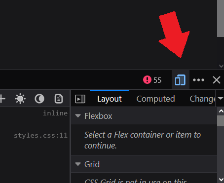

# Browser Game (Dungeon Crawler)

## Introduction
This project was created while attending UNLV Software Development Bootcamp at the end of the Web Design section. 

The intention of the project is for students to apply their knowledge of HTML, CSS, and Javscript to create an interactive game inside of the browser. Students are graded based on user experience, functionality, workflow, code style, and presentation. 

For my project, I chose to create a 2D game using the HTML Canvas. The objective of the game is to use the character and collect all 6 hidden items throughtout the map. Upon collecting 6 items, the success screen appears and allows the player to replay the game. 

## Inspiration
I've been playing video games for about 20 years. As I got older, I started wondering about how games were created. The passion of playing games then shifted into wanting to create them. When I was assigned this project, I instantly knew that I wanted to create a 2d game. Working with 16bit textures during this project brought me waves of nostalgia. It was extremely exciting to learn how to create 2d Tilemaps and create my own game. 

## Installation
==This game only supports 1920x1080 sized browsers==
You can play my game by cloning repository. Once you've cloned the repository please download Live Server as an extension. Afterwards, launch the index.html.

Alternatively you can use this link which leads to Github Pages.
``` https://b-mong.github.io/Milestone-Project-BrowserGame/ ```

==Temporary Bug Fix==
Once you've opened up my game, you will see that the objects are out of place. This is because the game only supports 1920x1080 resolution at the moment. The fix for this is to open up the browser dev-tools and open up the "responsive design tools". At the very top, set the resolution to 1920x1080.



## Known Bugs
- Resolutions besides 1920x1080, the game does display properly and cannot be played

## Future Updates
- Adding wall collision to the map so the character can not leave the canvas
- Adding the ability to pick up items with spacebar based on proximity to the fruit